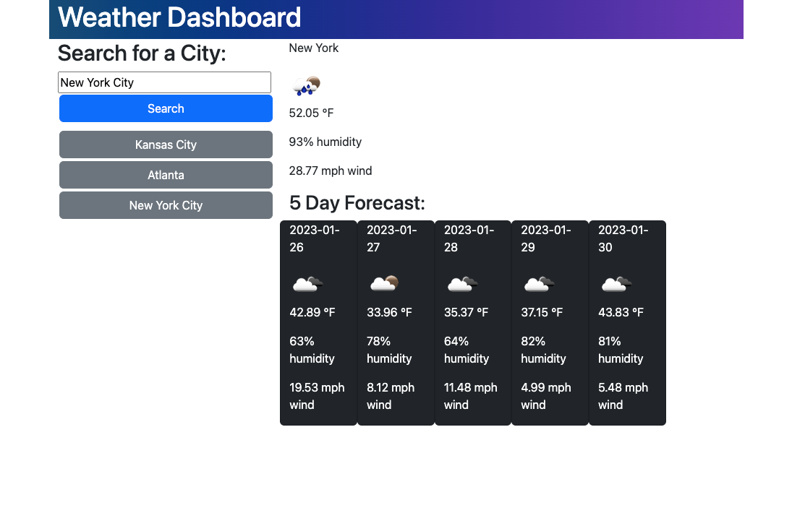

# Weather Dashboard

## Description

This weather dashboard uses data fetched from the OpenWeather API to display current weather conditions and a 5 day forecast.

## Installation 

N/A

## Usage

This app can be used to search for current weather data and 5 day forecast given a city's name.

[Deployed Website Link](https://ameliabigler.github.io/wistful-mollusk/)

## Credits

I referenced this site for information about displaying weather icons:
https://stackoverflow.com/questions/44177417/how-to-display-openweathermap-weather-icon

I referenced this site for information about nesting in Bootstrap:
https://getbootstrap.com/docs/4.1/layout/grid/#nesting

## License

Please refer to the license in the repo.
